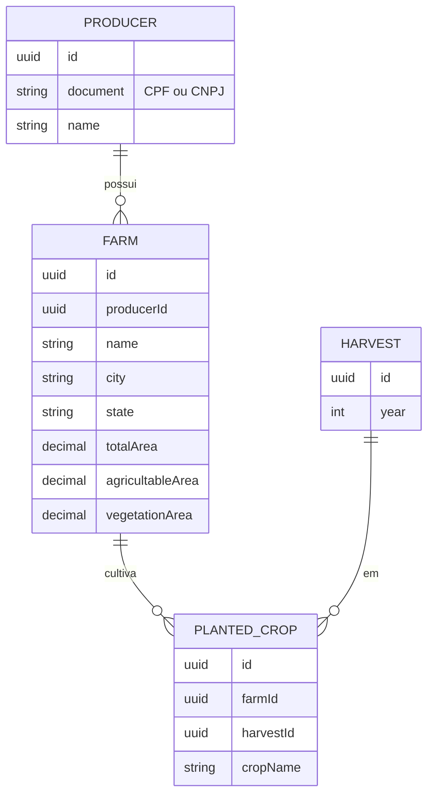

# Arquitetura
## Modelo de domínio



Regra de negócio central: `agricultableArea + vegetationArea <= totalArea`, validada na camada de
aplicação (não só no banco) para retornar erro de negócio claro (400) em vez de estourar constraint.

### Culturas plantadas repetidas na mesma fazenda/safra

`PlantedCrop` não tem constraint de unicidade em `(farmId, harvestId, cropName)` — é permitido registrar
a mesma cultura mais de uma vez para a mesma fazenda na mesma safra. Isso é intencional: o modelo não
representa talhões/parcelas dentro da fazenda, então uma fazenda que planta a mesma cultura em áreas ou
sistemas diferentes (ex.: parte irrigada e parte de sequeiro, ou dois plantios em janelas distintas da
mesma safra) precisa conseguir registrar cada plantio separadamente. Se o domínio evoluir para rastrear
talhão/área por plantio, essa decisão deve ser revisitada.

## Camadas (backend)

Cada módulo (`producers`, `farms`, `harvests`, `planted-crops`, `dashboard`) segue:

- **domain**: regras e validações de negócio puras (ex.: validador de CPF/CNPJ, regra de área)
- **application**: casos de uso / services, DTOs de entrada e saída
- **infrastructure**: controller REST + repositório Prisma

## API

Prefixo `/api`, documentação OpenAPI servida em `/api/docs` (Swagger UI).

| Recurso | Endpoints |
|---|---|
| Produtores | `GET/POST /api/producers`, `GET/PATCH/DELETE /api/producers/:id` |
| Fazendas | `GET/POST /api/farms`, `GET/PATCH/DELETE /api/farms/:id` |
| Safras | `GET/POST /api/harvests` |
| Culturas plantadas | `GET/POST /api/planted-crops`, `DELETE /api/planted-crops/:id` |
| Dashboard | `GET /api/dashboard/summary` |

`GET /api/dashboard/summary` retorna:

```json
{
  "totalFarms": 0,
  "totalHectares": 0,
  "byState": [{ "state": "SP", "count": 0 }],
  "byCrop": [{ "crop": "Soja", "count": 0 }],
  "landUse": { "agricultable": 0, "vegetation": 0 }
}
```

## Por que essas escolhas

- **NestJS + Prisma**: Nest dá a estrutura em camadas/DI pedida na vaga; Prisma reduz boilerplate de
  migration/query mantendo type-safety, com o client isolado na camada de infraestrutura.
- **Redux Toolkit + RTK Query**: gerenciamento de estado e cache de API pedidos explicitamente na vaga.
- **Ant Design** (tabelas/formulários) **+ styled-components** (tema): combina produtividade em componentes
  de dados com o diferencial de CSS-in-JS citado na vaga.
- **Fora de escopo (deliberado)**: micro-frontends (single-spa), Kubernetes/Terraform, Datadog/Grafana —
  diferenciais de vaga sênior que exigiriam infraestrutura paga ou escopo incompatível com um teste técnico.
